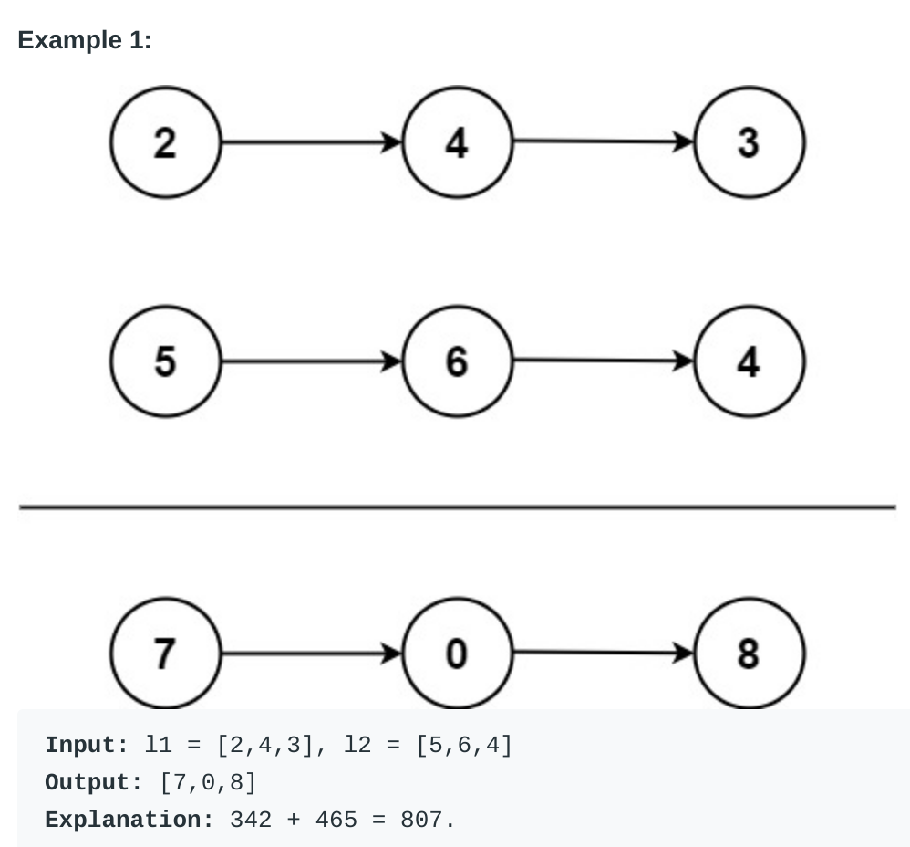

# Add Two Numbers (#2)
#### Difficulty:  ```Medium```
#### Description:
- You are given two non-empty linked lists representing two non-negative integers.
- The digits are stored in reverse order, and each of their nodes contains a
single digit. Add the two numbers and return the sum as a linked list.
- You may assume the two numbers do not contain any leading zero, except the
number 0 itself.

#### Example:

