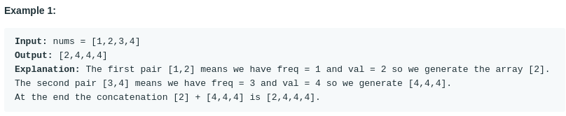

# Decompress Run-Length Encoded List (#1313)
#### Difficulty:  ```Easy```
#### Description:
- We are given a list nums of integers representing a list compressed with run-length encoding.
- Consider each adjacent pair of elements [freq, val] = [nums[2*i], nums[2*i+1]] (with i >= 0).  For each such pair, there are freq elements with value val concatenated in a sublist. Concatenate all the sublists from left to right to generate the decompressed list.
- Return the decompressed list.

#### Example:

