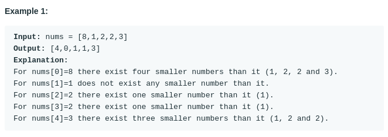

# How Many Numbers Are Smaller Than the Current Number (#1365)
#### Difficulty:  ```Easy```
#### Description:
- Given the array nums, for each nums[i] find out how many numbers in the array are smaller than it. That is, for each nums[i] you have to count the number of valid j's such that j != i and nums[j] < nums[i].
- Return the answer in an array.

#### Example:

