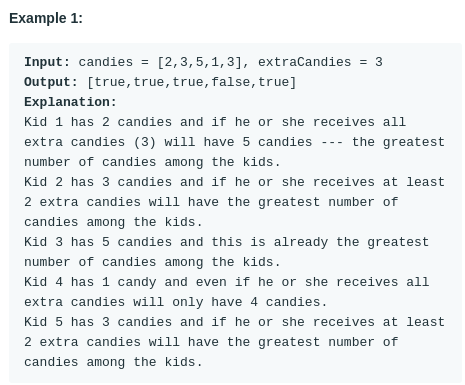

# Kids With the Greatest Number of Candies (#1431)
#### Difficulty:  ```Easy```
#### Description:
- Given the array candies and the integer extraCandies, where candies[i] represents the number of candies that the ith kid has.
- For each kid check if there is a way to distribute extraCandies among the kids such that he or she can have the greatest number of candies among them. Notice that multiple kids can have the greatest number of candies.

#### Example:

