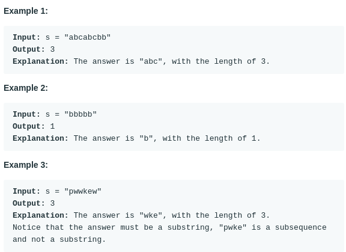

# Longest Substring Without Repeating Characters (#3)
#### Difficulty:  ```Medium```
#### Description:
- Given a string s, find the length of the longest substring without repeating characters.

#### Example:

