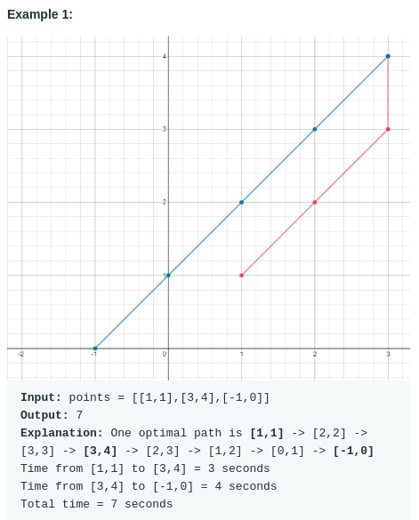

# Minimum Time Visiting All Points (#1266)
#### Difficulty:  ```Easy```
#### Description:
- On a plane there are n points with integer coordinates points[i] = [xi, yi]. Your task is to find the minimum time in seconds to visit all points.
- You can move according to the next rules:
  1. In one second always you can either move vertically, horizontally by one unit or diagonally (it means to move one unit vertically and one unit horizontally in one second).
  1. You have to visit the points in the same order as they appear in the array.

#### Example:

