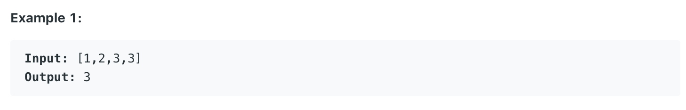

# N-Repeated Element in Size 2N Array (#961)
#### Difficulty: ```Easy```
#### Description:
- In a array A of size 2N, there are N+1 unique elements, and exactly one of these elements is repeated N times.
- Return the element repeated N times.

#### Example:

