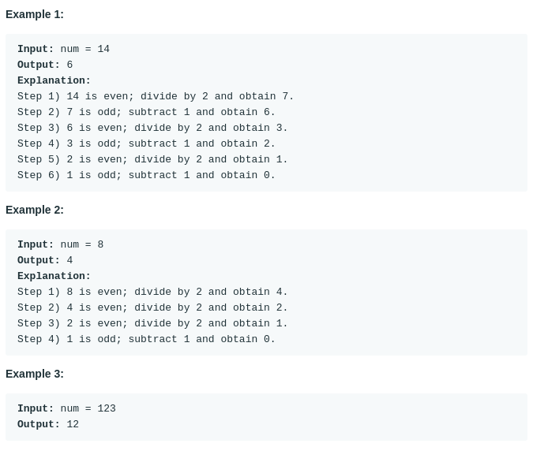

# Number of Steps to Reduce a Number to Zero (#1342)
#### Difficulty: ```Easy```
#### Description:
- Given a non-negative integer num, return the number of steps to reduce it to zero. If the current number is even, you have to divide it by 2, otherwise, you have to subtract 1 from it.

#### Example:

