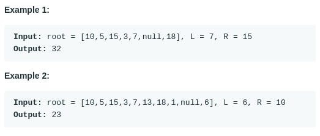

# Range Sum Of BST (#938)
#### Difficulty:  ```Easy```
#### Description:
- Given the root node of a binary search tree, return the sum of values of all nodes with value between L and R (inclusive).
- The binary search tree is guaranteed to have unique values.

#### Example:

