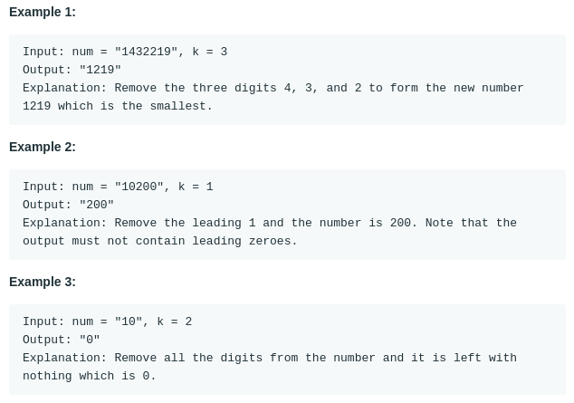

# Remove K Digits (#402)
#### Difficulty:  ```Medium```
#### Description:
- Given a non-negative integer num represented as a string, remove k digits from the number so that the new number is the smallest possible.
- Notes:
  - The length of num is less than 10002 and will be ≥ k.
  - The given num does not contain any leading zero.

#### Example:

