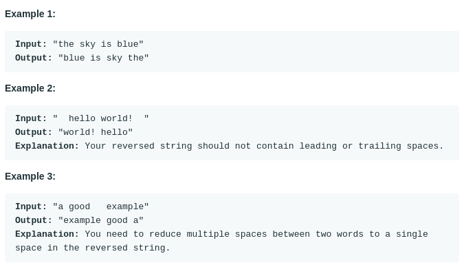

# Reverse Words in a String (#151)
#### Difficulty:  ```Medium```
#### Description:
- Given an input string, reverse the string word by word.
- Note:
  - A word is defined as a sequence of non-space characters.
  - Input string may contain leading or trailing spaces. However, your reversed string should not contain leading or trailing spaces.
  - You need to reduce multiple spaces between two words to a single space in the reversed string.

#### Example:

