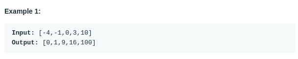

# Squares of a Sorted Array (#977)
#### Difficulty: ```Easy```
#### Description:
- Given an array of integers A sorted in non-decreasing order, return an array of the squares of each number, also in sorted non-decreasing order.

#### Example:

